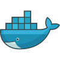
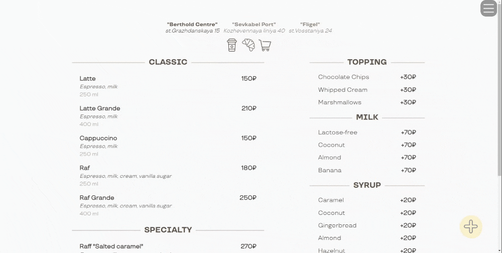
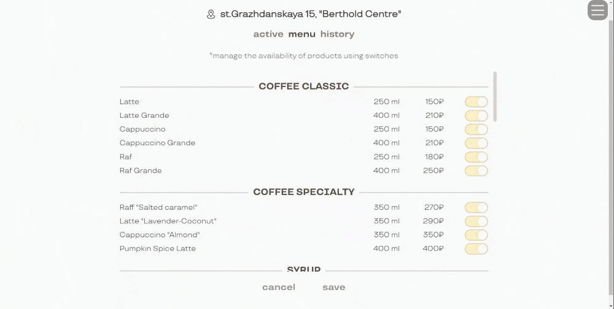
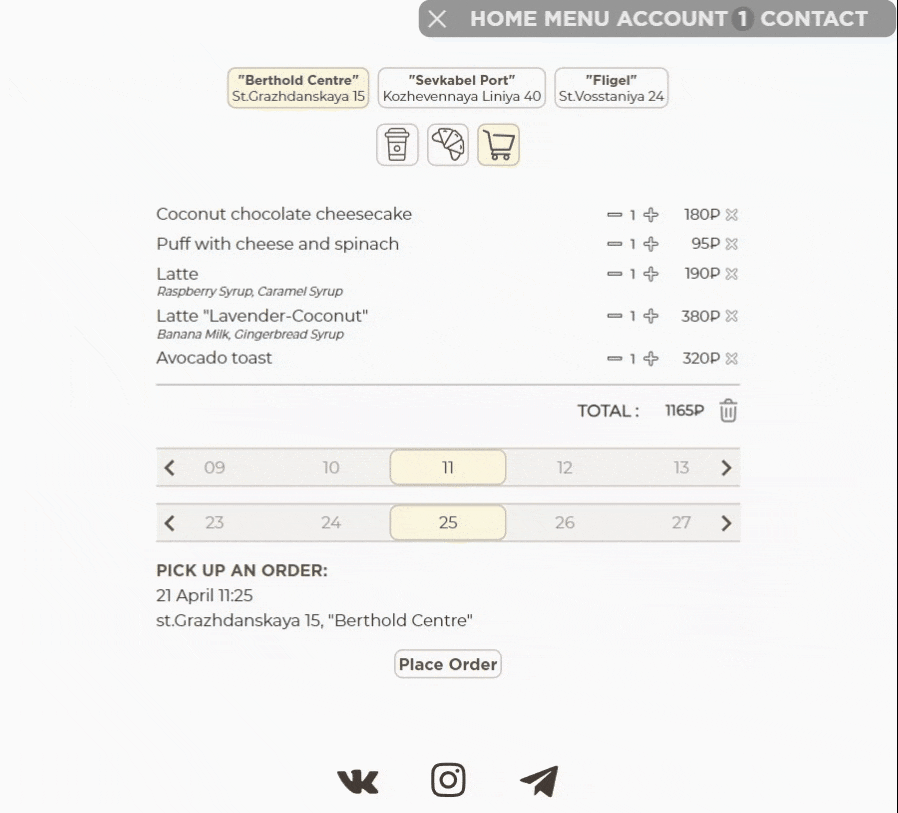
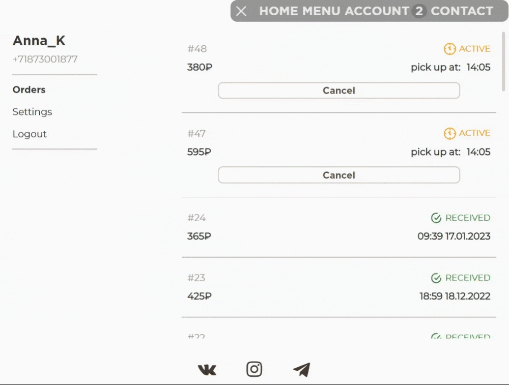

# :coffee: Coffee House Application

<div style="text-align: center">

[](#small_blue_diamond-docker-compose) [](#small_blue_diamond-railway)

</div>

## **<p style="text-align: center"> Coffee house app for ordering coffee and food. </p>**

:small_blue_diamond: **The Backend using Java with Spring Boot:**

- Authentication and authorization are performed using **Spring Security** and **JWT**
- Access to API endpoints using **Swagger UI** or **[Postman](./coffee-house-api/coffee-house-api.postman_collection.json)**
- Database migration with **Liquibase**
- **Validation** of request body
- **Logging** using **log4j2** to console output and file

:small_blue_diamond: **The Frontend using HTML, SCSS, JavaScript with VueJS:**

- Navigation using **Vue-router**
- **Vuex Store** as source of State
- **Axios** as module for network requests
- Validation of forms data using **Vuelidate**
- Responsive layout adapt to screen size

## :small_blue_diamond: Summary:

- **Home:** General description page.

- **Contact:** Link to the section with addresses and their marks on the map.

- **Menu:** There is a list of coffee house addresses and the menu shows only products available for the selected address. The menu is divided into categories: coffee and its additives, food and desserts.

  - for _**unauthorized**_ users and _**authorized**_ ones with the role of a _**standard user:**_ The standard menu available for ordering in the selected coffee house is shown. <details><summary>_User Menu_</summary>
     </details>

  - for _**authorized**_ user with the role of a _**manager:**_ All existing menu items are shown according to the manager's account linked to a specific coffee house. It is possible to update ordering availability for necessary items by changing the switch position. <details><summary>_Manager Menu_</summary>
     </details>

- **Cart:** It is possible to place an order only during the working hours of coffee house. The available time of order readiness should be selected in the carousel. If you change the coffee house selection, the cart will be updated and some items may be removed if they are not available for ordering for this address. <details><summary>_Cart_</summary>
   </details>

- **Account:**

  - for _**unauthorized**_ users: Login or registration forms are available. Validation of the entered field data is performed in accordance with the specified conditions. After successful authorization, resources are accessed using a **JWT in Authentication HTTP Header.** <details><summary>_Register Form_</summary>
     </details>

  - for _**authorized**_ users: In the account you can view the history of orders, cancel an active order, change the user name or password in the settings. <details><summary>_Account_</summary>
     </details>

- **Order management**: The page displays a list of active coffee house orders updated once a minute with the ability to change the order status to received or cancelled. There is also a search bar for orders by specified parameters: order id or time intervals of orders creation, pick up and closing dates, orders status. <details><summary>_Management_</summary>
   </details>

## :small_blue_diamond: Docker Compose

Build and run app with **Docker Compose**.

Start the docker containers from project directory using the following command :

```
docker-compose up -d
```

4 containers must be started:

- **api**

  - port : `8085`

- **frontend**

  - port : `8088`

- **postgres**

  - access to postgres : `localhost:5432`
  - **user** : postgres
  - **password** : postgres
  - **database** : coffee-house-db
  - **Liquibase [changelog](./coffee-house-api/src/main/resources/db/changelog/)** files has the necessary changesets for the database
  - the data generated by the postgres container is stored in the volume, so it will be used the next time the container is upped

- **pgadmin**
  - **pgAdmin4** is available at the link http://localhost:5050/
  - **password** : postgres
  - **server postgres@docker** will be added to connect to the database, use the postgres password to connect to the server

Once the containers are running successfully, you will be able to access :

- the **app** by the link : **http://localhost:8088**

- the **backend api** using :

  - Swagger UI by the link : **http://localhost:8085/swagger-ui.html**

  - **[Postman Collection](./coffee-house-api/coffee-house-api.postman_collection.json) :**
    - `token` - a necessary collection variable for accessing secured endpoints. It is received after successful authorization of the user

> For the example database will be initialized with test [data](./coffee-house-api/src/main/resources/db/changelog/). The password used to log in to the account is **`userPassword0`** for a **standard user** and **`managerPassword0`** for a **manager**

**Log4j2** .log files inside the container will be mapped to the **./logs** folder in the project directory which will be created when the app is run. To get .log files inside the container :

- go inside the container : `docker exec -it api sh`
- navigate to the folder /logs : `cd logs`
- view the list of files : `ls` and file content : `cat [log-file-name].log`

## :small_blue_diamond: Railway

App on **[Railway](https://railway.app/)** :

- the **app** by the link : **https://coffee-house.up.railway.app/#/**

- the **backend api** using :

  - **[Postman Collection](./coffee-house-api/coffee-house-api.postman_collection.json) :**
    - `base_url` - change collection variable to **https://coffee-house-api.up.railway.app**
    - `token` - a necessary collection variable for accessing secured endpoints. It is received after successful authorization of the user
