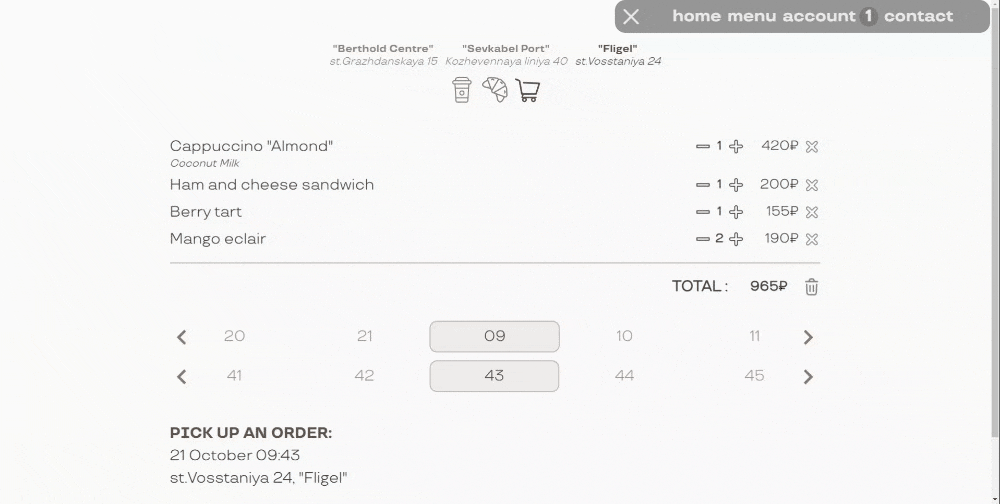
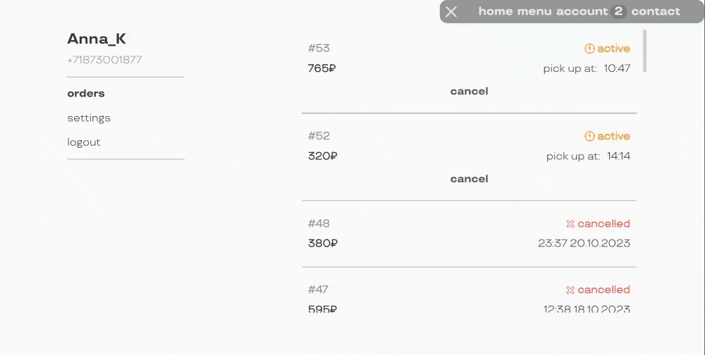

# :coffee: Coffee House Application

#### :small_blue_diamond: **Backend using Java with Spring Boot:**

- authentication and authorization are performed using **Spring Security** and **JWT**
- access to API endpoints using **swagger ui** or **[postman](./coffee-house-api/coffee-house-api.postman_collection.json)**
- database migration with **liquibase**
- **validation** of request body

#### :small_blue_diamond: **Frontend using HTML, SCSS, JavaScript with VueJS:**

- navigation using **vue-router**
- **vuex store** as source of State
- **axios** as module for network requests
- validation of forms data using **vuelidate**
- responsive layout adapt to screen size

## :small_blue_diamond: Summary:

- **home:** general description page <details><summary>_home_</summary>
   </details>

- **menu:** the menu is divided into categories: coffee and its additives, food and desserts, and shows only those products that are available for order at the selected coffee house <details><summary>_user menu_</summary>
   </details>

- **cart:** it is possible to place an order only during the working hours of the coffee house. Available time of order readiness should be selected in the carousel. If you change the coffee house selection, the cart will be updated and some products may be removed if they are not available for ordering for this address <details><summary>_cart_</summary>
   </details>

- **account:**

  - **unauthorized users:** login and registration forms are available with validation of the entered field data. After successful authorization, resources are accessed using a jwt in authorization header <details><summary>_register form_</summary>
     </details>

  - **authorized users:** in the account you can view the history of orders, cancel an active order, change the user name or password in the settings <details><summary>_account_</summary>
     </details>

- **management**: manager can monitor active orders, update the availability of menu products, view the order history in his coffee house

  - **active orders** page displays a list of orders updated once a minute with the ability to change the order status to received or cancelled <details><summary>_active orders_</summary>
     </details>

  - **search bar** for orders by specified parameters: order id or time intervals of orders creation, pick up and closing dates, orders status <details><summary>_order search bar_</summary>
     </details>

  - **menu** displays all existing products. It is possible to update the order availability for the necessary products by changing the switch position <details><summary>_manager menu_</summary>
     </details>

- content adapts to screen size <details><summary>_responsive layout_</summary>
   </details>

## :small_blue_diamond: Docker Compose

Build and run app with **docker compose** :

```
docker-compose up -d
```

Containers:

- **api**

  - port : `8085`

- **frontend**

  - port : `8088`

- **postgres**

  - liquibase [changelog](./coffee-house-api/src/main/resources/db/changelog/) files has the necessary changesets for the database

Once the containers are running successfully, you will be able to access :

- the app by the link : http://localhost:8088

- the backend api using :

  - swagger ui by the link : http://localhost:8085/swagger-ui.html

  - [postman collection](./coffee-house-api/coffee-house-api.postman_collection.json) :
    - `token` - a necessary collection variable for accessing secured endpoints. It is received after successful authorization of the user

> the database will be initialized with test [data](./coffee-house-api/src/main/resources/db/changelog/) for the example. Password used to log in to the account is `userPassword0` for a standard user and `managerPassword0` for a manager account
